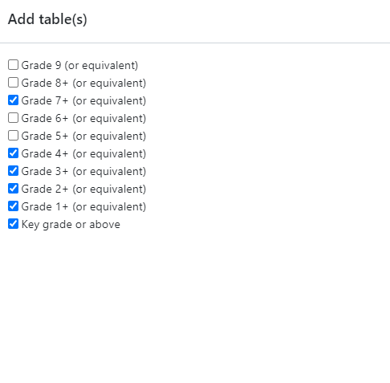
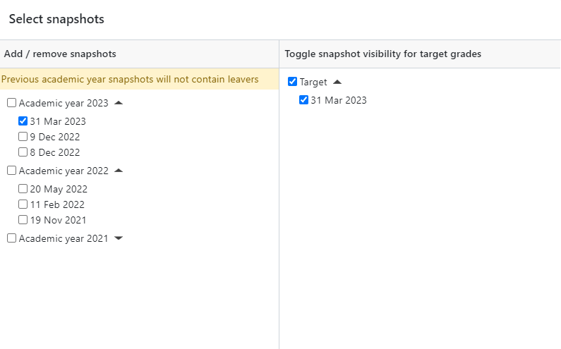

# CPD (Sept 13 2023)
 
1. Learn More TypeScript
2. Go over current project pages

## 1. Learn More TypeScript

### TypeScript Coding Standards ([Link To Source](https://dev.azure.com/Go4Schools/Development%20Training%20Portal/_wiki/wikis/Developer-Training-Portal.wiki/2953/TypeScript-Coding-standards-(Oct-2022)))

-  You can use either type or interface for your desired practice. Type is more suitible to define the shape of something.
-  Be explicit with `private` `protected` `readonly` keywords.

- Use Linting in visual studio by enabling it and installing the following packages:

    | Package | Github | Rules |
    |--|--|--|
    | [eslint-config-airbnb-base](https://www.npmjs.com/package/eslint-config-airbnb-base) | https://github.com/airbnb/javascript/tree/master/packages/eslint-config-airbnb-base/rules | https://airbnb.io/javascript/ |
    | [eslint-config-airbnb-typescript](https://www.npmjs.com/package/eslint-config-airbnb-typescript) | https://github.com/iamturns/eslint-config-airbnb-typescript/blob/master/lib/shared.js |  |
    | [@typescript-eslint/eslint-plugin](https://www.npmjs.com/package/@typescript-eslint/eslint-plugin) | https://github.com/typescript-eslint/typescript-eslint | https://typescript-eslint.io/rules/ |

- Enabling Eslint:
  
    - Run ```npx eslint --init```

#### Go4Schools Coding Standards Ruleset

- Add all the rules from [Link to Source](https://dev.azure.com/Go4Schools/Development%20Training%20Portal/_wiki/wikis/Developer-Training-Portal.wiki/2953/TypeScript-Coding-standards-(Oct-2022)?anchor=go-4-schools-ruleset) to the ```.eslintrc.json``` file.


#### File Structure

- One thing per file:
  
  - Class
  - Type
  - Etc

#### In the Project Solution

- Grunt handles the Building and Minification
  
  - Conversion of TS -> JS

#### Add TypeScript support with NuGet

- Install the package [Microsoft.TypeScript.MSBuild](https://www.nuget.org/packages/Microsoft.TypeScript.MSBuild)

### TypeScript Handbook ([Link To Souce](https://dev.azure.com/Go4Schools/Development%20Training%20Portal/_wiki/wikis/Developer-Training-Portal.wiki/2953/TypeScript-Coding-standards-(Oct-2022)))

#### TypeScript for Java/C# Programmers

- Offers better code completion, detection of errors and clearer communication between parts of a program.
- TypeScript supports many common patterns such as implementing interfaces, inheritance, and static methods.

#### Classes in TS

- Using the `private` keyword to protect the name property from being set outside the class.

    ```ts
    class Greeter {
        private name: string = "world";
    
        constructor(otherName?: string) 
        {
            if (otherName !== undefined) 
            {
                this.name = otherName;
            }
        }
    }
    const g = new Greeter();
    // g.name = "not allowed"; # due to the protection level
    ```

- Constructors (Normal Signature)

    ```ts
    class Point {
        x: number;
        y: number;
        
        // Normal signature with defaults
        constructor(x = 0, y = 0) {
            this.x = x;
            this.y = y;
        }
    }
    ```

- Construct (Overload Signature)

    ```ts
    class Point {
        // Overloads
        constructor(x: number, y: string);
        constructor(s: string);
        constructor(xs: any, y?: any) {
        // TBD
        }
    }

    const item1: Point = new Point(1, "string1"); // valid signature
    const item2: Point = new Point("string2"); // valid signature
    ```

- Super Calls (Error)

    ```ts
    class Base {
        k = 4;
    }
    
    class Derived extends Base {
        constructor() {
            // Prints a wrong value in ES5; throws exception in ES6
            console.log(this.k);
            // 'super' must be called before accessing 'this' in the constructor of a derived class.
            super();
        }
    }
    ```

- Super Calls (Working)

    ```ts
    class Base {
        k = 4;
    }
    
    class Derived extends Base {
        constructor() {
            super();
            console.log(this.k);
        }
    }
    ```

- Methods
  
    ```ts
    class Point {
        x = 10;
        y = 10;
    
        scale(n: number): void {
        this.x *= n;
        this.y *= n;
        }
    }

    let item1: Point = new Point();
    console.log(`${item1.x}, ${item1.y}`) // output: 10, 10
    item1.scale(10)
    console.log(`${item1.x}, ${item1.y}`) // output: 100, 100
    ```

- Class Heritage and Interfaces

    - Classes that implement an interface incorrectly as seen below will be alterted with a syntax error.
    - In the example below, 'Ball' does not implement the 'ping' Property and instead implements pong, this causes a syntax error.
    <br><br>

    ```ts
    interface Pingable {
        ping(): void;
    }
    
    class Sonar implements Pingable {
        ping() {
        console.log("ping!");
        }
    }
    
    class Ball implements Pingable {
    //   Class 'Ball' incorrectly implements interface 'Pingable'.
    //   Property 'ping' is missing in type 'Ball' but required in type 'Pingable'.
        pong() {
        console.log("pong!");
        }
    }
    ```

- Class Extentions

    ```ts
    class Animal {
        move() {
        console.log("Moving along!");
        }
    }
    
    class Dog extends Animal {
        woof(times: number) {
        for (let i = 0; i < times; i++) {
            console.log("woof!");
        }
        }
    }
    
    const d = new Dog();
    // Base class method
    d.move();
    // Derived class method
    d.woof(3);

    // Output: 
    //    Moving along!
    //    woof!
    //    woof!
    //    woof!   
    ```

    - Dog extends the animal class, giving it functionality from the `move` function and extends it with the `woof` function.


- Overriding Methods in Classes

    ```ts
    class Base {
    greet() {
        console.log("Hello, world!");
    }
    }
    
    class Derived extends Base {
    greet(name?: string) {
        if (name === undefined) {
        super.greet();
        } else {
        console.log(`Hello, ${name.toUpperCase()}`);
        }
    }
    }
    
    const d = new Derived();
    d.greet();
    d.greet("reader");

    // Output:
    //  Hello, world!
    //  Hello, READER
    ```

    - By re-defining the `greet` method, in the subclass, the Derived class will always run this instead of the one inherited. To run the inherited method, you need to use the `super` object.

#### Member Visibility

-  There are 3 main tags you can apply to members of a class to add different levels of visibility to them and who is able to access them.

- PUBLIC:

    ```ts
    class Greeter {
    public greet() {  // You dont actually need to put 'public' as it is the default
        console.log("hi!");
    }
    }
    const g = new Greeter();
    g.greet();
    ```

- PROTECTED:

    ```ts
    class Greeter {
    public greet() {
        console.log("Hello, " + this.getName());
    }
    protected getName() {
        return "hi";
    }
    }
    
    class SpecialGreeter extends Greeter {
    public howdy() {
        // OK to access protected member here
        console.log("Howdy, " + this.getName());
    }
    }
    const g = new SpecialGreeter();
    g.greet(); // OK
    g.getName(); // THIS DOES NOT WORK 

    // Syntax Error:
    //  Property 'getName' is protected and only accessible within class 'Greeter' and its subclasses.

    ```

- PRIVATE:

    ```ts
    class Base {
    private x = 0;
    }
    class Derived extends Base {
    Class 'Derived' incorrectly extends base class 'Base'.
    Property 'x' is private in type 'Base' but not in type 'Derived'.
    x = 1; // THIS DOES NOT WORK
    }

    // Syntax Error:
    //  Class 'Derived' incorrectly extends base class 'Base'. 
    //  Property 'x' is private in type 'Base' but not in type 'Derived'.

    ```

- BREAKING PRIVATE:

    ```ts
    class MySafe {
    private secretKey = 12345;
    }
    
    const s = new MySafe();
    
    // Not allowed during type checking
    console.log(s.secretKey);
    // Syntax Error:  
    //  Property 'secretKey' is private and only accessible within class 'MySafe'.
    
    // OK
    console.log(s["secretKey"]);
    ```

    - Square brackets can be used to access this 'soft private' member.

- HARD PRIVATE:

    ```ts
    class Dog {
        #barkAmount = 0;
        personality = "happy";
    
        constructor() {}

        bark() {
            console.log(`Barking with an amount of ${this.#barkAmount}`)
        }
    }

    let dog1: Dog = new Dog();
    dog1.bark();
    // Output: 
    //  Barking with an amount of 0

    console.log(dog1["#barkAmount"])
    // Syntax Error:
    //  Element implicitly has an 'any' type because expression of type 
    //  '"#barkAmount"' can't be used to index type 'Dog'.
    //  Property '#barkAmount' does not exist on type 'Dog'.
    ```

    - The member `#barkAmount` is fully private to the `Dog` class.

#### Generic Classes

- Example 1:
  
    ```ts
    class Box<Type> {
        contents: Type;
        constructor(value: Type) {
        this.contents = value;
        console.log(this.contents);
        }
    }
    
    const a = new Box(true);
    const b = new Box("hello!");
    const c = new Box(12345);
    const d = new Box(["String1",1234,true,false,{"dictItem":123}])

    // Output:
    //  true
    //  hello!
    //  12345
    //  [ 'String1', 1234, true, false, { dictItem: 123 } ]
    ```

- This class accepts any type as its input with no syntax errors, dynamic like JS.

#### Arrow Functions

-  We use arrow functions when the values for `this` is lost in a certain context.

    ```ts
    class MyClass {
        name = "MyClass";
        getName = () => {
        return this.name;
        };
    }
    const c = new MyClass();
    const g = c.getName;
    // Prints "MyClass" instead of crashing
    console.log(g());
    ```

- The trade-offs are that. The `this` value is guaranteed to be correct at runtime.
- Will use more memory, each class instance will have its own copy of the function.
- You cant use `super.getName` in a derived class.

#### Parameter Properties

- TypeScript allows the constructor to turn its parameters directly into class properties with the same names and values.

- These are called parameter properties and are created by prefixing a constructor argument with a visibility modifier.

    ```ts
    class Params {
        constructor(
        public readonly x: number,
        protected y: number,
        private z: number
        ) {
        // No body necessary
        }
    }
    const a = new Params(1, 2, 3);
    console.log(a.x); // This Works
                
    console.log(a.z);
    // Syntax Error:
    //  Property 'z' is private and only accessible within class 'Params'.
    ```

## 2. Go over current project pages

#### Pages to consider:
  - Year Group At A Glance Page
  - Year Group Key Statistics Page
  - Curriculum Overview Page
  - Curriculum Analysis Page
  - Attainment Over Time Page

### Year Group At A Glance Page

- Notes:

    - Includes some summarisations of features such as:
      - Targets and Progress
      - Key Statistics
      - RPI - Projected
      - Attendance
      - Behaviour
    - These summarisations are in the form of widget like components that stretch and shrink to cover the whole screen. Maximum row of two widgets.
    - All widgets have a redirect in their title to the full version of each component.
    - Nearly all widgets have a modal pop up option, to view the data as a chart or as its tabular equivalent.
    - Most widgets are interactive.
    - Includes Contextual Information Modal Popup.

- Questions:

### Year Group Key Statistics Page

- Notes:
  
    - Includes some of the key information about a given year group.
    - This could be for example:
      - Avg Progress 8 score per student
      - Grade 5 or above in English and Maths
      - English Baccalaureate - Average Points Score
      - English Baccalaureate - Percentage of pupils entering
      - Etc.
    - Options to `Select grade types`, activating a modal with checkboxes to toggle grade types and an ordering mechanism next to it to prioritise the order certain grade types.
    - Another option is `Download CSV` allowing the user to export the contents of the table of this page to a .CSV format.
    - Coloured Cells have links to the year group explorer.
    - There is also an option to `Remember grade types`.
    - Navigation button also availiable to go to the other new pages. Has the text `Go to...` on it.

- Questions:

    - How is `Remember grade types` remembered? Stored with the user in the db?
        - Answer: Likely local storage

### Curriculum Overview Page

- Notes:

    - This page provides an overview of various curriculums for a year group.
    - The first section is `Pass Rates by Subject` which includes the following features:
        - `Add Table(s)` - Determines which tables of grades are loaded given a baseline grade and the percentages are calculated based on grades above or equivelent to it.
        - `Select Grade Types` - same as KS Page
        - `Select Snapshots` - selects a snapshot date from the database of a given time period of data. Compares that snapshot data with current data.
        - `Sort Subjects by` - can sort either by department or alphabetically.
        - `Percentage/Counts` - toggle the data representation between percentages and counts (personal preference)
        - `Load/Save Table Sets` - Save the selections youve made on the page to the database to be loaded again in future.
        - `Visualise Trends` - adds colouring to the table with green for positive trends and red for negative trends.
        - Includes student and subject filtering options.
        - Can be downloaded to a `.csv` file
        - If checked there is also `Key grade or above` which includes data about the key grades and has the following features:
          - Includes student and subject filtering options.
          - Can be downloaded to a `.csv` file.
    - Second Section is `Average Points Per Subject`
      - Same options as the section above, with the addition of different tables:
        - Average GCSE numeric points per subject.
        - Average APS points per subject.

- Questions:

    - Does the top grade table take priority always in this list? i.e. 7+ is all that is used?

        

      - Answer: All of them will load below.

    - I noticed that snapshots dont really have a pattern to them in terms of dates. Are these snapshots selected by the schools and generated for that day?

        

        These seem a bit random?

        - Answer: The schools can choose when to take the snapshot. It's when they make a report, probably mid term, or near the end.

### Curriculum Analysis Page

- Notes:

    - `Year group ribbons` Section has the following features:
      - Add Ribbon(s)
      - Zoom In and Out (3 Sizes)
      - Remember Ribbons Checkbox
      - Sort Residual Ribbons
      - Sort Grade Distribution Ribbons
      - Includes student and subject filtering options.
      - Can View the tabular representation of the data and export to `.csv` file too.
  - `RPI - Projected` Section has the following features:
      - A graph of the projected RPI values
      - Grade Type Selecter
      - Includes student and subject filtering options.

- Questions:


### Attainment Over Time Page

- Notes:

    - **Progess 8 Score**:
        
        - Progress 8 measures how well students at a secondary school do in their GCSEs compared to their achievements when they started at the school. A score of 0 means they did as expected. Above 0 means they did better than expected. Below 0 means they did worse than expected.

    - This page shows the data for a year group drilled into over a given time period. It includes the following features:
      - `Add Measure(s)` - this allows a user to add one or more given measures to a AOT table such as Progress 8 score, Attainment 8 score, Grade 5 or above in English or Maths (Old Score) etc. Measures show the end of year 11 target and the predicted value.
      - `Add Focus Group(s)` - Focus on a particular group of students in the table. This adds additional rows to the table, subsetting the data for each measure.
      - `Select Grade Types` - For each measure you can select the types of grades you want shown. I.e. End of Year 11 Target, Predicted, Aspirational Etc.
      - `Select Snapshots` - If one or more snapshots are selected, the grade is then split into the snapshot(s) column(s) and the current value (Now).
      - `Percentage / Counts` - A toggle between the value representation. A percentage or a count.
      - `Load / Save Data Sets` - Save the selections youve made on the page to the database to be loaded again in future.

- Questions:
    - How are `predicted` values calculated on the site? Teachers input, Algorithm, ML?
        - Answer: "Teacher Input"
