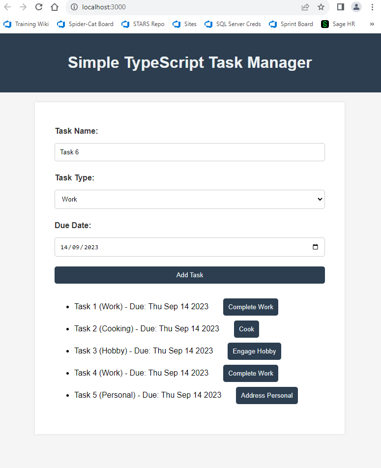

# CPD (Sept 14 2023)
 
1. TypeScript Task List Project
2. Additional TypeScript Notes
3. F1 Car Inheritance Console App with Enums, Interfaces and Types
4. Explore the TypeScript Files in the Stars.Web.School Solution

### 1. TypeScript Task List Project

Using concepts such as `enum` and `interface` from TypeScript, this simple Web App was created.

#### Enums
- Hold the values for each of the possible task types.
- This includes:
    ```ts
    enum TaskType {
        WORK = "Work",
        PERSONAL = "Personal",
        HOBBY = "Hobby",
        EXERCISE = "Exercise",
        COOKING = "Cooking"
    }
    ```

- Components of the site used this enum such as the 'Task Type' selector which is populated only with values from the enumerated definition for `TaskType`. You can see how the selector is populated from the following code snippet:
    ```ts
    function populateTaskTypeDropdown(): void {
        const taskTypeDropdown = document.getElementById("taskType") as HTMLSelectElement;
        for (const taskType in TaskType) {
            if (TaskType.hasOwnProperty(taskType)) {  // Check is direct enum property                         
                const option = document.createElement("option"); 
                option.value = TaskType[taskType as keyof typeof TaskType];  // gets and sets the string value 
                option.textContent = TaskType[taskType as keyof typeof TaskType]; // gets and sets the string value
                taskTypeDropdown.appendChild(option); // add to dropdown
            }
        }
    }
    ```

-  When a task is added, the representation of the value from Task Type is in its enumerated format. An example of this can be seen from the following snippet of code:
    ```ts
    const taskType = (document.getElementById("taskType") as HTMLSelectElement).value as TaskType;
    ```

#### Interfaces

- Interfaces in TypeScript play a vital role in ensuring type safety and consistent object structures. In the provided code, the `Task` interface is utilized in various ways:

- **Type Definition**

    - The `Task` interface provides a concrete structure that any object labeled as a `Task` must adhere to:

        ```typescript
        interface Task {
            id: number;
            name: string;
            type: TaskType;
            dueDate: Date;
        }
        ```

- **Array Type Definition**

    - The `Task` interface also defines the type for an array of tasks:

        ```ts
        let tasks: Task[] = [];
        ```
    - Every object in the tasks array must conform to the Task structure.

- **Function Parameter and Return Types**

    - When functions are defined, TypeScript allows type specifications for parameters and return values. The Task interface is used in this context too. For example:

        ```ts
        function addTask(name: string, type: TaskType, dueDate: Date): void {
            const newTask: Task = {
                id: Date.now(),
                name,
                type,
                dueDate
            };
            tasks.push(newTask);
        }
        ```
    - Here, newTask is explicitly typed as a Task, ensuring its conformity to the defined structure.

#### Web Page Screen Shot
- 

### 2. Additional TypeScript Notes 

- Types in TypeScript:

    ```ts
    type coder = 
    {
        name: string;
        knownFor: string[];
    }

    let coder1: coder = {
    name: "Ben",
    knownFor: ["Eating","Sleeping","Repeating"]
    };

    console.log(coder1);

    // Output: { name: 'Ben', knownFor: [ 'Eating', 'Sleeping', 'Repeating' ] }
    ```

- Abstract Classes in TypeScript:
  
    ```ts
    abstract class Department {
        constructor(public name: string) {}
    
        printName(): void {
            console.log("Department name: " + this.name);
        }

        abstract printMeeting(): void; // must be implemented in derived classes
    }
    
    class AccountingDepartment extends Department {
        constructor() {
            super("Accounting and Auditing"); // constructors in derived classes must call super()
    }
    
    printMeeting(): void {
        console.log("The Accounting Department meets each Monday at 10am.");
        this.generateReports(); // Exists within AccountingDepartment so "generateReports" can be called here
    }
    
    generateReports(): void {
        console.log("Generating accounting reports...");
    }
    }
    
    let department: Department; // ok to create a reference to an abstract type
    department = new AccountingDepartment(); // ok to create and assign a non-abstract subclass
    department.printName();
    department.printMeeting();
    department.generateReports();
    // ^ Syntax Error for "department.generateReports();"
    // Property 'generateReports' does not exist on type 'Department'.
    ```

### 3. F1 Car Inheritance Console App with Enums, Interfaces and Types

- Base Idea of Program:
  - 

- Enums Created:

    ```ts
    export enum SpeedType {
        Superfast,
        Fast,
        Slow,
        Superslow,
    }
    ```

- Types Created:

    ```ts
    export type Licence = {
        DriverName: string,
        DriverAge: number,
        DriverAddress: string,
        MaxSpeedPermission: SpeedType
    }
    ```

- Interfaces Created:

    ```ts
    export interface Car {
        carName: string,
        speedClass: SpeedType,
        driver: Driver

        drive(): void;
        park(): void;
        canDriveCarClass(): boolean;
    }
    ```

- Classes Created: 

    ```ts
    export default class Driver{

        public driversLicence: Licence

        constructor(private driverName: string, private driverAge: number, private driverAddress: string){

            let classifiedSpeed: SpeedType;

            if (driverAge < 16){
                classifiedSpeed = SpeedType.Superslow;
            }
            else if (driverAge >= 16 && driverAge < 18){
                classifiedSpeed = SpeedType.Slow;
            }
            else if (driverAge >= 18 && driverAge < 20){
                classifiedSpeed = SpeedType.Fast;
            }
            else if (driverAge >= 20 && driverAge < 40){
                classifiedSpeed = SpeedType.Superfast;
            }
            else if (driverAge >= 40 && driverAge < 60){
                classifiedSpeed = SpeedType.Fast;
            }
            else if (driverAge >= 60 && driverAge < 80){
                classifiedSpeed = SpeedType.Slow;
            }
            else {
                classifiedSpeed = SpeedType.Superslow;
            }
            
            this.driversLicence = {DriverName: driverName, DriverAge: driverAge, DriverAddress: driverAddress, MaxSpeedPermission: classifiedSpeed};
        }

        showLicence(): void {
            ...
            /// code shows the information in the drivers licence.
            ...
        }
    }
    ```
- Implementing the Car Interface as a Class:

    ```ts
    class F1Car implements Car {

        public speedClass: SpeedType = SpeedType.Superfast;

        constructor(public carName: string, public driver: Driver){
        }
        drive(): void {
            if (this.canDriveCarClass()){
                console.log("Driver: "+this.driver.driversLicence.DriverName + " is driving the " + this.carName)
            }
            else {
                console.log("Driver: "+this.driver.driversLicence.DriverName + " cannot drive the " + this.carName + 
                " as they are not classified to drive this speed type of '"+ SpeedType[this.speedClass] + "'");
            }
        }
        park(): void {
            if (this.canDriveCarClass()){
                console.log("Driver: "+this.driver.driversLicence.DriverName + " is parking the " + this.carName)
            }
            else {
                console.log("Driver: "+this.driver.driversLicence.DriverName + " cannot park the " + this.carName + 
                " as they are not classified to drive this speed type of '"+ SpeedType[this.speedClass] + "'");
            }
        }
        canDriveCarClass(): boolean {
            if (this.driver.driversLicence.MaxSpeedPermission <= this.speedClass) {
                return true
            }
            else {
                return false
            }
        }
    }
    ```

- App Execution Code:

    ```ts
    let driver1: Driver = new Driver("Lewis Hamilton",38,"Monaco");
    driver1.showLicence();

    let oldMan: Driver = new Driver("John Smith",86,"Oxford");
    oldMan.showLicence();

    let f1Car1 = new F1Car("W13",driver1);
    f1Car1.drive();
    f1Car1.park();

    let f1Car2 = new F1Car("W13", oldMan);
    f1Car2.drive();
    f1Car2.park();

    // Output: 

    // Drivers Licence for: Lewis Hamilton
    // Age: 38
    // Address: Monaco
    // Max Permitted Speed: Superfast

    // Drivers Licence for: John Smith
    // Age: 86
    // Address: Oxford
    // Max Permitted Speed: Superslow

    // Driver: Lewis Hamilton is driving the W13
    // Driver: Lewis Hamilton is parking the W13

    // Driver: John Smith cannot drive the W13 as they are not classified to drive this // speed type of 'Superfast'
    // Driver: John Smith cannot park the W13 as they are not classified to drive this speed type of 'Superfast'
    ```

### 4. Explore the TypeScript Files in the Stars.Web.School Solution

- Compilation:

    - This happens in the typescript module itself.
  
- Seperation of Code Tree:

    ```
    ├───TS
        ├───Classes
        ├───Enums
        ├───Functions
        ├───Interfaces
        ├───Pages
        ├───Types
        └───ViewComponents
    ```

- Looked at different files and saw how they link with each other. E.g. how Classes use types and implement interfaces etc.


