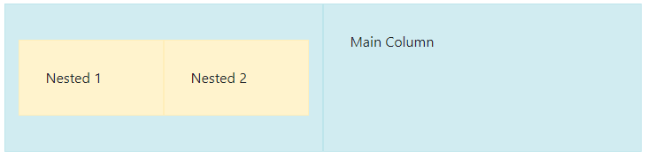

# CPD (November 17 2023)

## Responsive Design

Link to Work Wiki - [here](https://dev.azure.com/Go4Schools/Development%20Training%20Portal/_wiki/wikis/Developer-Training-Portal.wiki/113/Responsive-Design)

### CSS Grid Layout Module from W3 Schools
- Resource located at - [here](https://www.w3schools.com/css/css_grid.asp)

#### Grid Templates
- When defining a grid container, you can explicitly state the template by using the `grid-template-areas` property in CSS. This allows you to create a grid layout with named areas, making it easier to place and align items. Here's how you can use this approach:

    ##### Example 1: Predefined Grid Template
    CSS:
    ```CSS
    .container {
    display: grid;
    grid-template-columns: repeat(6, 1fr); /* Creates six columns */
    grid-template-rows: auto; /* Rows adjust to content size */
    grid-gap: 10px; /* Space between grid items */
    grid-template-areas: 
        "header header header header header header"
        "menu main main main right right"
        "menu footer footer footer footer footer";
    }

    .header {
    grid-area: header;
    }

    .menu {
    grid-area: menu;
    }

    .main {
    grid-area: main;
    }

    .right {
    grid-area: right;
    }

    .footer {
    grid-area: footer;
    }
    ```

    HTML:
    ```html
    <div class="container">
    <div class="header">Header</div>
    <div class="menu">Menu</div>
    <div class="main">Main Content</div>
    <div class="right">Right Sidebar</div>
    <div class="footer">Footer</div>
    </div>
    ```

    Container Visuals:

   

    ##### Example 2: Auto Placement

    CSS:
    ```css
    .container {
    display: grid;
    grid-template-columns: repeat(3, 1fr); /* Three columns */
    grid-template-rows: auto; /* Rows adjust to content size */
    grid-gap: 10px; /* Space between grid items */
    }
    ```

    HTML:
    ```html
    <div class="container">
        <div>Item 1</div>
        <div>Item 2</div>
        <div>Item 3</div>
        <div>Item 4</div>
        <div>Item 5</div>
        <div>Item 6</div>
        <div>Item 7</div>
        <!-- More items -->
    </div>
    ```    

    Container Visuals:

    


#### The `grid-column` Property

- The `grid-column` property defines on which column(s) to place an item.
  - You define where the item will start, and where the item will end.
  
    :bulb: **Note:** *The `grid-column` property is a shorthand property for the     `grid-column-start` and the `grid-column-end` properties.*

CSS:
```css
.grid-container {
  display: grid;
  grid-template-columns: auto auto auto auto auto auto;
  gap: 10px;
  background-color: #2196F3;
  padding: 10px;
}

.grid-container > div {
  background-color: rgba(255, 255, 255, 0.8);
  text-align: center;
  padding: 20px 0;
  font-size: 30px;
}

.item1 {
  grid-column: 1 / span 3;
}
```

HTML:
```html
<div class="grid-container">
    <div class="item1">1</div>
    <div class="item2">2</div>
    <div class="item3">3</div>  
    <div class="item4">4</div>
    <div class="item5">5</div>
    <div class="item6">6</div>
    <div class="item7">7</div>
    <div class="item8">8</div>  
    <div class="item9">9</div>
    <div class="item10">10</div>
    <div class="item11">11</div>
    <div class="item12">12</div>
    <div class="item13">13</div>
    <div class="item14">14</div>
    <div class="item15">15</div>
    <div class="item16">16</div>
</div>
```


Container Visuals:


#### The `grid-row` Property

- The `grid-row` property defines on which row to place an item.
  - You define where the item will start, and where the item will end.
  
    :bulb: **Note:** *The `grid-row` property is a shorthand property for the `grid-row-start` and the `grid-row-end` properties.*

CSS:

```css
.grid-container {
  display: grid;
  grid-template-columns: auto auto auto auto auto auto;
  gap: 10px;
  background-color: #2196F3;
  padding: 10px;
}

.grid-container > div {
  background-color: rgba(255, 255, 255, 0.8);
  text-align: center;
  padding: 20px 0;
  font-size: 30px;
}

.item1 {
  grid-row: 1 / span 2;
}
```

HTML:

```html
<div class="grid-container">
    <div class="item1">1</div>
    <div class="item2">2</div>
    <div class="item3">3</div>  
    <div class="item4">4</div>
    <div class="item5">5</div>
    <div class="item6">6</div>
    <div class="item7">7</div>
    <div class="item8">8</div>  
    <div class="item9">9</div>
    <div class="item10">10</div>
    <div class="item11">11</div>
    <div class="item12">12</div>
    <div class="item13">13</div>
    <div class="item14">14</div>
    <div class="item15">15</div>
    <div class="item16">16</div>
    <div class="item17">17</div>
</div>
```

Container Visuals:


### Bootstrap Grid System from GetBootstrap
- Resource located at - [here](https://getbootstrap.com/docs/4.1/layout/grid/)

#### Grid Options:
  
- See how aspects of the Bootstrap grid system work across multiple devices with the following table.

    

#### Basic Grid Layout:
  
CSS:

```css
.row { 
  margin-bottom: 10px; 
}

.col-md-4 { 
  background-color: #f8d7da; 
  border: 1px solid lightcoral; 
  border-width: 5px;
  padding: 10px;
}
```

HTML:

```html
<div class="container">
    <div class="row">
        <div class="col-md-4">Column 1</div>
        <div class="col-md-4">Column 2</div>
        <div class="col-md-4">Column 3</div>
        <div class="col-md-4">Column 4</div>
        <div class="col-md-4">Column 5</div>
    </div>
</div>
```

Container Visuals:

- Wide Page:

    

- Narrow Page:

    

#### Responsive Grid Layout

CSS:

```css
.row { 
  margin-bottom: 10px; 
}

.col-sm-6, .col-lg-4 { 
  background-color: #d4edda; 
  border: 1px solid #c3e6cb; 
  padding: 10px; 
}
```

HTML:

```html
<div class="container">
<div class="row">
    <div class="col-sm-6 col-lg-4">Column 1</div>
    <div class="col-sm-6 col-lg-4">Column 2</div>
    <div class="col-sm-12 col-lg-4">Column 3</div>
</div>
</div>
```

Container Visuals:

- Wide Page:
  
    

- Narrow Page:

    

- Very Narrow Page:

    

#### Nested Grids

CSS:

```css
.row { 
  margin-bottom: 10px; 
}

.col-md-6 { 
  background-color: #d1ecf1; 
  border: 1px solid #bee5eb; 
  padding: 30px; 
}

.col-md-6 .row .col-md-6 { 
  background-color: #fff3cd; 
  border: 1px solid #ffeeba; 
}
```

HTML:

```html
<div class="container">
    <div class="row">
      <div class="col-md-6">
        <div class="row">
          <div class="col-md-6">Nested 1</div>
          <div class="col-md-6">Nested 2</div>
        </div>
      </div>
      <div class="col-md-6">Main Column</div>
    </div>
</div>
```

Container Visuals:

- Wide Page:

    

- Narrow Page:

    

#### Alignment and Ordering

CSS:

```css
.row { 
  margin-bottom: 10px; 
}

.col-md-4 { 
  background-color: #e2e3e5; 
  border: 1px solid #d6d8db; 
  padding: 10px; 
}
```

HTML:

```html
<div class="container">
    <div class="row">
      <div class="col-md-4">Column 1</div>
      <div class="col-md-4 offset-md-4">Column 3</div>
    </div>
</div>
```

Container Visuals:

- Wide Page:

    

- Narrow Page:

    

#### Card Layout Grid

CSS:

```css
.card {
  margin-bottom: 15px;
}

.card-title {
  color: #007bff;
}
```

HTML:

```HTML
<div class="container my-3">
    <div class="row">
        <div class="col-md-4">
            <div class="card">
                <div class="card-body">
                    <h5 class="card-title">Card Title 1</h5>
                    <p class="card-text">Some quick example text.</p>
                </div>
            </div>
        </div>
        <div class="col-md-4">
            <div class="card">
                <div class="card-body">
                    <h5 class="card-title">Card Title 2</h5>
                    <p class="card-text">Some quick example text.</p>
                </div>
            </div>
        </div>
        <div class="col-md-4">
            <div class="card">
                <div class="card-body">
                    <h5 class="card-title">Card Title 3</h5>
                    <p class="card-text">Some quick example text.</p>
                </div>
            </div>
        </div>
    </div>
</div> 
```

Container Visuals:

- Wide Page:
  
    

- Narrow Page:
  
    

#### Membership Pricing Example

CSS:
```css
.pricing-card {
    border: 1px solid #ddd;
    padding: 20px;
    margin-bottom: 15px;
    text-align: center;
    border-radius: 5px;
    background-color: #f8f9fa;
}

.price {
    font-size: 24px;
    color: #007bff;
}

ul {
    list-style: none;
    padding: 0;
}

ul li {
    margin-bottom: 10px;
    color: #6c757d;
}
```

HTML:
```html
<div class="container my-4">
    <div class="row">
        <div class="col-md-4">
            <div class="pricing-card">
                <h3>Basic</h3>
                <p class="price">$19/month</p>
                <ul>
                    <li>Feature 1</li>
                    <li>Feature 2</li>
                    <li>Feature 3</li>
                </ul>
                <button class="btn btn-primary">Choose Plan</button>
            </div>
        </div>
        <div class="col-md-4">
            <div class="pricing-card">
                <h3>Pro</h3>
                <p class="price">$39/month</p>
                <ul>
                    <li>Feature 1</li>
                    <li>Feature 2</li>
                    <li>Feature 3</li>
                    <li>Feature 4</li>
                </ul>
                <button class="btn btn-primary">Choose Plan</button>
            </div>
        </div>
        <div class="col-md-4">
            <div class="pricing-card">
                <h3>Premium</h3>
                <p class="price">$59/month</p>
                <ul>
                    <li>Feature 1</li>
                    <li>Feature 2</li>
                    <li>Feature 3</li>
                    <li>Feature 4</li>
                    <li>Feature 5</li>
                </ul>
                <button class="btn btn-primary">Choose Plan</button>
            </div>
        </div>
    </div>
</div>
```

Container Visuals:

- Wide Page:

    

- Narrow Page:

    


#### F1 Driver Profiles Example:

CSS:
```css
.team-card {
    text-align: center;
    border: 1px solid #ddd;
    padding: 20px;
    margin-bottom: 20px;
    border-radius: 5px;
    color: #fff;
}

.ferrari {
    background-color: #dc0a2d; /* Ferrari Red */
}

.mercedes {
    background-color: #00d2be; /* Mercedes Teal */
}

.redbull {
    background-color: #1e41ff; /* Red Bull Blue */
}

h3 {
    margin-bottom: 10px;
}

p {
    font-size: 14px;
}
```

HTML:
```html
<div class="container my-4">
    <h2 class="text-center mb-4">Formula 1 Team Standings</h2>
    <div class="row">
        <div class="col-md-4">
            <div class="team-card ferrari">
                <h3>Scuderia Ferrari</h3>
                <p>Points: 320</p>
                <p>A storied team with a rich history in F1 racing.</p>
            </div>
        </div>
        <div class="col-md-4">
            <div class="team-card mercedes">
                <h3>Mercedes-AMG Petronas</h3>
                <p>Points: 305</p>
                <p>Recent years' dominant force in F1, known for innovation.</p>
            </div>
        </div>
        <div class="col-md-4">
            <div class="team-card redbull">
                <h3>Red Bull Racing</h3>
                <p>Points: 289</p>
                <p>Competitive and ambitious, a top contender in the sport.</p>
            </div>
        </div>
        <!-- Repeat for more teams -->
    </div>
</div>
```

Container Visuals:

- Wide Page:

    

- Narrow Page:

    


### Responsive Web Design: What is it and how to use it

- Resource located at - [here](https://www.smashingmagazine.com/2011/01/guidelines-for-responsive-web-design/)

#### Notes:

- Most clients these days want a mobile version of their website. This causes issues with different required screen sizes etc. (iPad, Kindle, iPhone, TV)
  - It can then be hard to keep up with this and change for new devices coming out.

- **Responsive Web Design** is the approach that suggests that design and development should respond to the user's behavior and environment based on screen size, platform and orientation.
  - This practice consists of a mix of flexible grids and layouts, images and an intelligent use of CSS media queries.

- A major part of the solution is to **make everything flexible**.

## Vue.js

### What is Vue?

Vue is a progressive framework for building user interfaces. Unlike other monolithic frameworks, Vue is designed from the ground up to be incrementally adoptable.

The core library is focused on the view layer only, and is easy to pick up and integrate with other libraries or existing projects. 

On the other hand, Vue is also perfectly capable of powering sophisticated Single-Page Applications when used in combination with modern tooling and supporting libraries.

### Useful Commands

- Preparing app for production: `npm run build`