# CPD (October 23 2023)

1. C# Optimisation
2. SQL Optimisation
3. Javascript Optimisation

Performance optimization in programming involves refining code to make it more efficient, allowing programs to run faster or consume less memory. In C#, SQL, and JavaScript, optimization is crucial for responsive, resource-efficient applications, ensuring quick data operations, smooth user interactions, and efficient server-side processing, essential for scalability and user satisfaction.

## 1. C# Optimisation

- Resources:
  - [.NET Performance Tips](https://learn.microsoft.com/en-us/dotnet/framework/performance/performance-tips)
  - [Performance Considerations of Class Design and General Coding in .NET](https://www.codeproject.com/Articles/812678/Performance-Considerations-of-Class-Design-and-Gen)
  

### Boxing and Unboxing
- **Boxing** is the process of converting a value type instance into an object type or an interface type that the value type implements.

  Simple Boxing Example:

  ```c#
  int value = 42; // value type
  object obj = value; // boxing
  ```

-  **Unboxing** is the process of converting an instance of a reference type    (boxed) back into a value type.

    Simple Unboxing Example:

    ```c#
    object obj = 42; // boxing
    int value = (int)obj; // unboxing
    ```

    A performance concideration on to avoid this as these operations have performance overheads. This could be memory allocation, time allocation which may be significant at run time.

- Solution:

  Alternatives to boxing and unboxing could be to use type safe data structures such as generics.

    ```c#
    // Non-generic collection - causes boxing and unboxing
    ArrayList arrayList = new ArrayList();
    int number = 5;
    arrayList.Add(number); // Boxing occurs here
    int retrievedNumber = (int)arrayList[0]; // Unboxing occurs here

    // Generic collection - prevents boxing and unboxing
    List<int> numberList = new List<int>();
    numberList.Add(number); // No boxing, the collection's type is known
    retrievedNumber = numberList[0]; // No unboxing, the type is known
    ```

### Strings

- Large string concatenation can be inefficient when done in large volumes due to the immuatbility of strings in C#. Each concatenation requires a new string, which leads to increased memory usage and poor performance.

- The `System.Text.StringBuilder` class helps mitigate this issue with efficient string manipulations.

- String Concatenation Approach:

    ```c++
    string combinedString = "";

    for (int i = 0; i < 100000; i++)
    {
        combinedString += "some sample text ";
    }
    ```

- StringBuilder Approach:

    ```c++
    StringBuilder sb = new StringBuilder();

    for (int i = 0; i < 100000; i++)
    {
        sb.Append("some sample text "); 
    }
    combinedString = sb.ToString();
    ```

- Performance Results:

    ```cmd
    String Concatenation Approach:
    Time elapsed: 00:00:33.7934736
    StringBuilder Approach:
    Time elapsed: 00:00:00.0005245
    ```

### Finalizers
- A finalizer is a special method used to release unmanaged resources held by an instance of a class when the object is being collected by a garbage collector. It is the C# equivalent of a destructor.

- A bad use case of a finalizer is using an empty finalizer as this just wastes resources as its unnessesary work.

- Finalizer Good Practice Example:
  
    ```c++
    public class SomeResourceHolder
    {
        private IntPtr buffer; // Pointer to an unmanaged resource.
        
        public SomeResourceHolder()
        {
            // Assume buffer is allocated here.
        }

        // Finalizer
        ~SomeResourceHolder()
        {
            // Release the unmanaged resource.
            if (buffer != IntPtr.Zero)
            {
                // Free the memory.
                System.Runtime.InteropServices.Marshal.FreeHGlobal(buffer);
                buffer = IntPtr.Zero;
            }
        }
    }
    ```

- It is the garbage collector itself that calls the finalizer method `~SomeResourceHolder()`.

### Structs Vs Classes
- Use `structs` for small, single-level, and immutable objects, where memory allocations are critical and cost of copying is cheaper than the cost of allocation.

- Use `classes` for larger, complex or multi-level objects, where the cost of copying is high.

- Considerations also come into the lifetime of these objects.

- Use `structs` in performance-critical paths, like:
  - Tight Loops (executing rapidly)
  - Graphics Rendering


## 2. SQL Optimisation
- Resources:
  - [SQL Indexing and Tuning e-Book](https://use-the-index-luke.com/)
  - [SQL Query Optimization: How to Tune Performance of SQL Queries](https://blog.devart.com/how-to-optimize-sql-query.html)

### Importance of Indexing
- Indexing is so important in the realm of databases, its primary purpose is to enhance retrieval speed.
- Without indexes, a database system would have to scan every row (linear search) to retrieve the desired data. This is also known as a full table scan.
- Indexes are a shortcut allowing the system to jump directly to the location where the desired data resides.

### Clustered Index
- This is a special type of index in relational database, only one is allowed per table.
- This index determines the physical order of the data in the table. Reading the data in the order of the clustered index is very fast.
- Retrieving rows based on this index is sequential.

### Indexes are helpful for:
- The overall query cost.
- ORDER BY & GROUP BY operations.
- JOIN operations

### Reducing the number of OR conditions a filter
- Multiple conditions in an OR can severly affect performance. Some of the reasons are:
  - Complexity
  - Index Utilization
  - Execution plan may struggle

- Example of a performance boost:

    Bad Query:

    ```sql
    SELECT *
    FROM Circuits
    WHERE country = 'UK'
    OR alt > 400;
    ```

    Improved Query:

    ```sql
    SELECT * FROM Circuits
    WHERE country = 'UK'
    UNION
    SELECT * FROM Circuits
    WHERE alt > 400;
    ```

### Observing Performance 

- [Statistics Parser](https://statisticsparser.com/) is a useful site to help database administrators and developers quickly understand and analyze SQL query performance by presenting the statistical data in a more readable and organized format.


## 3. Javascript Optimisation
- Resources:
  - [JavaScript Performance](https://www.w3schools.com/js/js_performance.asp)
  - [JavaScript performance optimization](https://developer.mozilla.org/en-US/docs/Learn/Performance/JavaScript)

### Reduce Activity in Loops

- Loops can run faster if we reduce the calculation inside the loop definition.

- For example, here are two examples of the same loop but the second one is optimised for better performance:
  
  Bad Loop:

    ```js
    for (let i = 0; i < arr.length; i++) 
    {
        console.log(i)
    }
    ```

  Good Loop:

    ```js
    let l = arr.length;
    for (let i = 0; i < l; i++)
    {
        console.log(i)
    }
    ```

    The seond loop is better as we do not need to read arr.length on each iteration, this reduces the cost of performance.

### Reduce DOM Size
- By keeping the number of elements in the HTML DOM small it will improve page loading and speed up rendering.
- Searches to the DOM, like `getElementsByTagName`, will benefit from a smaller DOM.

### Avoid Unnecessary Variables
- Avoid creating new variables if they are only used once or not planned to be saved.

- Example:
  
  This:
  ```js
  let fullName = firstName + " " + lastName;
  document.getElementById("demo").innerHTML = fullName;
  ```

  Can be re-written as this:
  ```js
  document.getElementById("demo").innerHTML = firstName + " " + lastName;
  ```

### Delay JavaScript Loading
- Putting Scripts at the botom of the page is better as it will let the browser load the page first.
- Alternatively you could also add into the script tag `defer="true"`. This specifies that the script should be executed after the page has finished parsing.
  - Only works for external scripts.

### Avoid Using the `with` Keyword
- This keyword has a negative affect on speed.
- Clutters JavaScript scopes.
- Not allowed in strict mode.

### Removing Event Listeners that are no longer needed
- Onced used for their indended (if singular) purpose, then these event listeners are redundant and can be removed. Otherwise, wasted processing is going to the methods listening for something that will never be used again.

### Optimise Loops
- We can optimise array manipulation using `Map()`, `Filter()` and `Reduce()`.

#### Map Example

```js
let numbers = [1, 2, 3, 4, 5];
let squaredNumbers = [];
for (let i = 0; i < numbers.length; i++) {
  squaredNumbers.push(numbers[i] * numbers[i]);
}

// Using Map() Instead
let numbers = [1, 2, 3, 4, 5];
let squaredNumbers = numbers.map(number => number * number);
```

#### Filter Example
```js
let numbers = [1, 2, 3, 4, 5, 6];
let evenNumbers = [];

for (let i = 0; i < numbers.length; i++) {
  if (numbers[i] % 2 === 0) {
    evenNumbers.push(numbers[i]);
  }
}

// Using Filter() Instead
let numbers = [1, 2, 3, 4, 5, 6];
let evenNumbers = numbers.filter(number => number % 2 === 0);
```

#### Reduce Example
```js
let numbers = [1, 2, 3, 4, 5];
let sum = 0;

for (let i = 0; i < numbers.length; i++) {
  sum += numbers[i];
}

// Using Reduce() Instead
let numbers = [1, 2, 3, 4, 5];
let sum = numbers.reduce((accumulator, currentValue) => accumulator + currentValue, 0);
```

Diagram of How Map Filter and Reduce can be used together:



### Efficient Type Checking
- Using === and !=== as well is better than == and !=

Ways to perform type checking in JS efficiently examples:

1. Using `typeof` :

    ```js
    let num = 1;
    if (typeof num === 'number') {
    console.log('num is a number');
    }

    let str = "text";
    if (typeof str === 'string') {
    console.log('str is a string');
    }
    ```

2. Using `instanceof` :

    ```js
    let arr = [];
    if (arr instanceof Array) {
    console.log('arr is an array');
    }

    class CustomClass {}
    let obj = new CustomClass();
    if (obj instanceof CustomClass) {
    console.log('obj is an instance of CustomClass');
    }
    ```


3. Using `Array.isArray` :

    ```js
    let arr = [];
    if (Array.isArray(arr)) {
    console.log('arr is an array');
    }
    ```

4. Using `.constructor` :
   
    ```js
    let obj = {};
    if (obj.constructor === Object) {
    console.log('obj is a plain object');
    }
    ```

5. Using `===` for null/undefined checks:
   
   ```js
   let val = null;
    if (val === null) {
    console.log('val is null');
    }

    val = undefined;
    if (val === undefined) {
    console.log('val is undefined');
    }
   ```